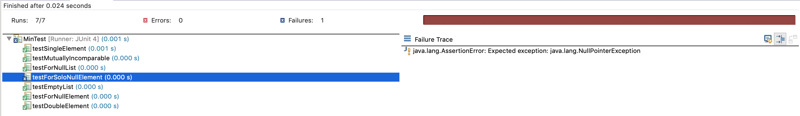

# Chapter 3 Exercises 
## Team: Súbete a Mi Bici 
### Katia Chumakova, Gabriel Trujillo, Mark Rivera, Ismael Lizárraga 

#### Question 1. 
##### Why do testers automation testing? What are the limitations of automation?

Testers usually automate testing to reduce cost and human error and it is way faster than the manual testing and it has a wider test coverage. Some limitations of automation testing are that it is very hard to design sufficient tests and it can take up a lot of time as well as additional tools. 

#### Question 2. 
Controllability is, in escence, the possibility of forcing the system to a particular state by application of control input. This means that the system can be controlled and thus we can do whatever we want with it. Observability is the property that the system's states can be observed, meaning we can see the input and output of our system easily. 
Inheritance can affect controllability because if there is a high level of inheritance, meaning there are many classes that inherit from many others, then we may not be able to control it. We would need to control each class and its "parent". And if there are many parents, then the ability to control the system becomes more and more complicated. 
Also Observability becomes an issue with inheritance for the same reason. If we have a system with a high level of hierarchy, then it becomes harder and harder to observe the classes that actually do the work.

#### Question 3. 
##### Develop JUnit tests for the BoundedQueue class. A compilable version is available on the book website in the file BoundedQueue.java. Make sure your tests check every method, but we will not evaluate the quality of your test designs and do not expect you to satisfy any test criteria. Turn in a printout of your JUnit tests and either a printout or a screen shot showing the results of each test.

Refer to BoundedQueue.java and BoundedQueueTest.java file in this folder. 

#### Question 4.
##### Delete the explicit throw of NullPointerException in the Min program. Verify that the JUnit test for a list with a single null element now fails. 

Refer to Min.java and Mintest.java files in this folder

Also here is included an image where it can be seen that the JUnit test indeed fails when removing the explicit throw of NullPointerException in the Min program.

#### Question 6.
##### Consider the following example class: PrimeNumbers …

(a)	A test that does not reach the fault

<code>

    import org.junit.Test;
    
    import static org.junit.Assert.*;

    @Test
    public void testComputePrimes() {
	    PrimeNumbers pn = new PrimeNumbers();
    	Int[] result = pn.computePrimes(0); 
	    assertEquals([], result); // never executes de while loop 
    }
</code>

(b)	A test that reaches the fault, but does not infect

<code>

    import org.junit.Test;
    import static org.junit.Assert.*;

    @Test
    public void testComputePrimes() {
        PrimeNumbers pn = new PrimeNumbers();
        Int[] result = pn.computePrimes(18);
        assertEquals([2,3,5,7,11,13,17], result); 
    }

</code>

(c) A test that infects the state, but does not propagate
<code>
    
    import org.junit.Test;
    import static org.junit.Assert.*;

    @Test
    public void testComputePrimes() {
        PrimeNumbers pn = new PrimeNumbers();
        Int[] result = pn.computePrimes(24);
        assertEquals([2,3,5,7,11,13,17,19,23], result); 
    }
    // State is affected but doesn’t affect rest of calculations

</code>

(d)	A test that propagates, but does not reveal

This is impossible, as soon as the program reaches the fault (which would be calculating the primes of 19 it would infect and there would be an incorrect program state and return value. // no calculations depend on these numbers.

(e) A test that reveals the fault

<code>
    
    import org.junit.Test;
    import static org.junit.Assert.*;

    @Test
    public void testComputePrimes() {
        PrimeNumbers pn = new PrimeNumbers();
        Int[] result = pn.computePrimes(19);
        assertEquals([2,3,5,7,11,13,17,19], result);
    }

</code>

#### Question 7.

<code>
    
    public class PrimeNumbers implements Iterable<Integer>
    {
        private List<Integer> primes = new ArrayList<Integer>();
        public void computePrimes (int n)
        {
            // initially assume all integers are prime
            boolean[] isPrime = new boolean[n+1];
            for (int i = 2; i <= n; i++) {
                isPrime[i] = true;
            }

            // mark non-primes <= n using Sieve of Eratosthenes
            for (int factor = 2; factor*factor <= n; factor++) {

                // if factor is prime, then mark multiples of factor as nonprime
                // suffices to consider mutiples factor, factor+1, ...,  n/factor
                if (isPrime[factor]) {
                    for (int j = factor; factor*j <= n; j++) {
                        isPrime[factor*j] = false;
                    }
                }
            }

            // count primes
            for (int i = 2; i <= n; i++) {
                if (isPrime[i] && (i % 10 != 9)) {
                    primes.add(i);
                }    
            }
        }

        @Override public Iterator<Integer> iterator()
        {
            return primes.iterator();
        }
        @Override public String toString()
        {
            return primes.toString();
        }
    }

</code>

As you can see, now the algorithm uses the Sieve of Eratosthenes to find prime numbers. But it can have false positives, one example is the exact test case (a) in question 6. 

<code>

    import org.junit.Test;
    
    import static org.junit.Assert.*;

    @Test
    public void testComputePrimes() {
	    PrimeNumbers pn = new PrimeNumbers();
    	Int[] result = pn.computePrimes(0); 
	    assertEquals([], result); // never executes de while loop 
    }
</code>

This will not make the loops run and will return a false positive result. This is the first false positive result. In fact, there will be many false positives, the fault will not be visible until the loop tries to run all the way to prime "9". Then the fault will be visible and executed. 

This exercise can tell that the RIPR model should be used in order to truly know if there is a fault in the system. Otherwise we can have many false positives and think that our program runs perfectly, but in reality it has a fault waiting to propagate. 